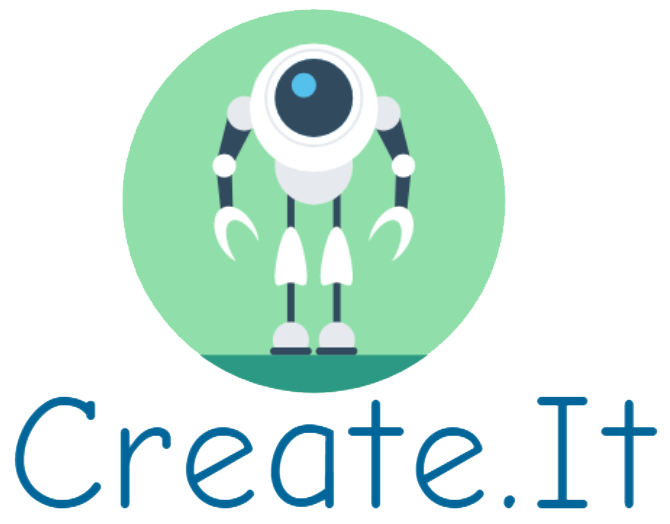

  
  <h3 align="center">Tired of creating repos manually?</h3>
  
Let the robots at Create.It handle that tedious task for you!

  
Create.It is a command line interface (CLI)  that allows you to create a repository on  your favorite git version control platform.  Whether that be GitHub or Bitbucket. 

  

    <a href="https://github.com/AhadKhan98/Create.It/issues">Report Bug</a>
    ·
    <a href="https://github.com/AhadKhan98/Create.It/issues">Submit Feature</a>
  

## How it Works

## Getting Started

## Contributing
We would absolutely love for you to help us in making Create.It better by contributing to our project. Head to the Contributors page to get started right away!

## Code of Conduct
We promote an open and a welcoming environment in this community. We pledge to making participation in our project and our community a harassment-free experience for everyone, regardless of age, body size, disability, ethnicity, sex characteristics, gender identity and expression, level of experience, education, socio-economic status, nationality, personal appearance, race, religion, or sexual identity and orientation.
Learn more about our [Code of Conduct](https://github.com/AhadKhan98/Create.It/blob/master/CODE-OF-CONDUCT.md).

## Video Demo
Watch our demo on [YouTube](https://google.com/)

## License
[MIT @ MLH Fellowship 2020](https://github.com/AhadKhan98/Create.It/blob/master/LICENSE)

Made with ❤ by [Ahad Zai](https://github.com/ahadkhan98) and [Mondale Felix](https://github.com/MondaleFelix) during MLH Fellowship Explorer Sprint 4 (Fall 2020)
